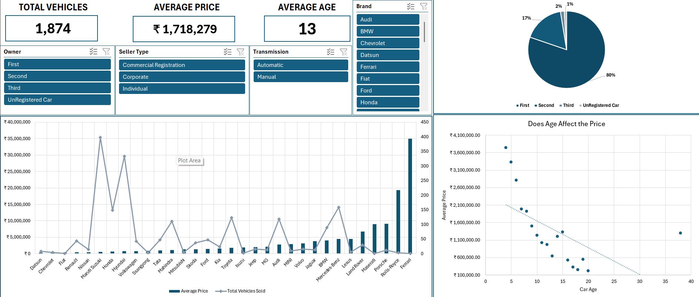

# 🚗 Used Car Market Analytics Dashboard
### *End-to-End BI Solution: From Raw Data to Executive Insights*

 

## 📌 Project Overview
This project transforms a raw dataset of over 1,000 used car listings into an interactive business intelligence tool. The goal was to identify the primary drivers of vehicle resale value and provide a user-friendly interface for market comparison and valuation.

**Key Deliverables:**
* **Cleaned Dataset:** Processed via Power Query for 100% data integrity.
* **Executive Dashboard:** A protected, interactive UI for dynamic market analysis.

## 🛠️ Tech Stack & Methodologies
* **Engine:** Microsoft Excel (Office 365)
* **ETL:** Power Query (M Language)
* **Modeling:** Power Pivot & DAX (Data Analysis Expressions)
* **Visualization:** PivotCharts, Dynamic Linked Objects, and Slicers

## 🔍 Deep Dive: The Analytics Workflow

### 1. Advanced ETL (Power Query)
* **Unit Parsing:** Converted text-heavy technical specs (e.g., "1197 cc", "88.5 bhp") into numeric data types to enable mathematical aggregation.
* **Feature Engineering:** * Created `Car_Age` column derived from `Model_Year` (Base year 2026).
  * Standardized `Brand` and `Model` names to fix data entry inconsistencies.
* **Data Scrubbing:** Removed irrelevant high-cardinality columns (e.g., Torque) and filtered null records in mechanical fields to prevent skewing averages.

### 2. Data Modeling & DAX
To ensure a professional and scalable structure, I utilized **explicit measures** rather than implicit totals:
* **`Total Vehicles`**: `COUNTROWS(Cars_Raw)` — Serves as the master volume metric.
* **`Unique Brands`**: `DISTINCTCOUNT(Cars_Raw[Brand])
